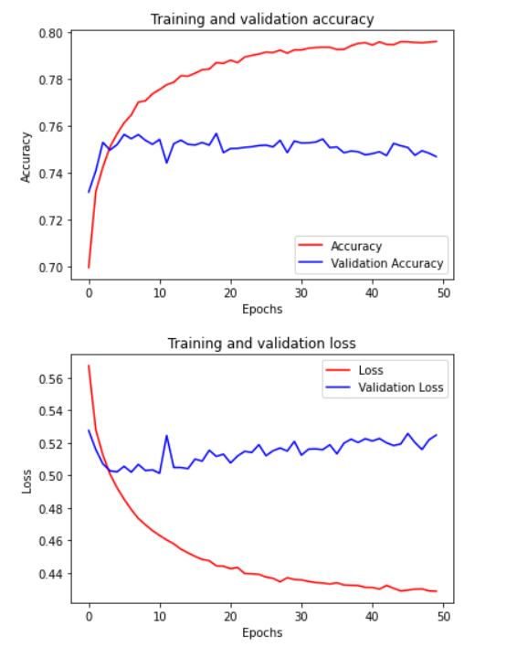

# TensorFlow-Developer - Professional-Certificate

TensorFlow is one of the most in-demand and popular open-source deep learning frameworks available today. The DeepLearning.AI TensorFlow Developer Professional Certificate program teaches you applied machine learning skills with TensorFlow so you can build and train powerful models. 

